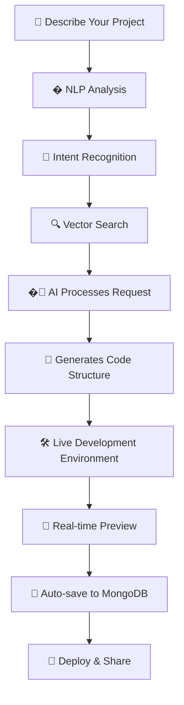

<div align="center">

# ✨ SiteSmith

### 🚀 Build Something Amazing with AI

*Transform your ideas into functional web applications through natural language conversations with AI*

[](https://github.com/Mukul2956/Sitesmith/stargazers)
[](https://opensource.org/licenses/MIT)
[](https://nodejs.org/)
[](https://www.typescriptlang.org/)

[🎬 View Demo](#-demo) • [🚀 Quick Start](#-quick-start) • [📚 Documentation](#-documentation) • [💬 Community](#-community)

</div>

---

## 🎯 What is SiteSmith?

SiteSmith is a revolutionary **AI-powered web development platform** that transforms natural language descriptions into fully functional web applications. No more struggling with boilerplate code or complex setup processes – just describe what you want to build, and watch the magic happen! ✨

<div align="center">
  
### 🎬 Demo

> **Coming Soon:** Interactive demo showcasing SiteSmith's capabilities

</div>

## 🌟 Key Features

<table>
<tr>
<td width="50%">

### 🤖 **Multiple AI Providers**
- **NVIDIA API** - Free tier available
- **Claude AI** - Premium experience
- **Extensible architecture** for future providers

### 🧠 **Smart NLP Processing**
- **Vector Search with FAISS** - Semantic code understanding
- **Intent Recognition** - Auto-detects modification types
- **Context-Aware Analysis** - Understands code relationships
- **Confidence Scoring** - Measures request clarity

### 💾 **Smart Project Management**
- Auto-save with MongoDB persistence
- Project history & version tracking
- Status filtering (active, completed, archived)

</td>
<td width="50%">

### 🛠️ **Full-Stack Development**
- Monaco Editor (VS Code engine)
- Live preview with WebContainer
- Built-in terminal & file explorer
- Real-time code generation

### ⚡ **Intelligent Change Processing**
- **Smart Change Analysis** - AI-powered request optimization
- **Optimized Prompt Generation** - Better AI instructions
- **Affected Files Detection** - Knows what needs changing
- **Complexity Estimation** - Predicts modification difficulty

### 🎨 **Modern Tech Stack**
- React + TypeScript + Vite
- Tailwind CSS for styling
- Express.js backend
- MongoDB Atlas database

</td>
</tr>
</table>

## 🚀 Quick Start

### Prerequisites

Before you begin, ensure you have:
- 📦 **Node.js 18+** installed
- 🔑 **AI Provider API Key** (NVIDIA or Claude)
- 🍃 **MongoDB Atlas** connection (optional, for project persistence)

### Installation

```bash
# 1️⃣ Clone the repository
git clone https://github.com/Mukul2956/Sitesmith.git
cd Sitesmith

# 2️⃣ Install backend dependencies
cd backend && npm install

# 3️⃣ Install frontend dependencies  
cd ../frontend && npm install

# 4️⃣ Configure environment variables
cd ../backend && cp .env.example .env
# Edit .env file with your API keys and MongoDB URI

# 5️⃣ Start the development servers
# Terminal 1 - Backend
npm run dev

# Terminal 2 - Frontend (in another terminal)
cd frontend && npm run dev
```

### 🎉 Launch

- **Frontend**: Open your browser and navigate to **`http://localhost:8080`**
- **Backend**: Runs on **`http://localhost:5000`**

That's it! You're ready to build something amazing! 🚀

## 🌐 Deployment

### 🚀 Vercel Deployment (Frontend)

SiteSmith is ready for deployment on Vercel! The frontend is already configured with:

- ✅ Environment variables setup (`.env` and `.env.example`)
- ✅ Vercel configuration (`vercel.json`)  
- ✅ All API calls use `VITE_BACKEND_URL` environment variable
- ✅ Proper `.gitignore` configuration

#### Quick Deploy Steps:

1. **Expose Backend** (since you'll run it locally):
   ```bash
   # Start your backend first
   cd backend && npm run dev
   
   # In another terminal, expose with ngrok
   ngrok http 5000
   ```
   
   **⚠️ Note**: You'll get a new ngrok URL each time you restart it (unless using paid plan).

2. **Deploy to Vercel**:
   - Go to [vercel.com](https://vercel.com) and import your repository
   - Set **Root Directory** to `frontend`
   - Add environment variable: `VITE_BACKEND_URL=https://your-ngrok-url.ngrok.io`
   - Deploy!

3. **Update Backend CORS** (already configured for your URLs):
   ```javascript
   // Already added to backend/src/index.ts
   const allowedOrigins = [
     'https://sitesmith-three.vercel.app',  // Your Vercel domain
     'https://your-ngrok-url.ngrok.io',     // Your ngrok URL  
     'http://localhost:8080',               // Local development
     'http://localhost:5173'                // Alternative local port
   ];
   ```

4. **Each Time You Restart**:
   - Get new ngrok URL: `ngrok http 5000`
   - Update `VITE_BACKEND_URL` in Vercel dashboard
   - Vercel will auto-redeploy

📖 **Detailed Guide**: See `DEPLOYMENT_GUIDE.md` for complete deployment instructions and troubleshooting.

## 🧠 Smart NLP Features

### 🎯 **Intelligent Change Processing**

SiteSmith v2.0 introduces revolutionary **Natural Language Processing** capabilities that make code modifications faster, more accurate, and context-aware:

<details>
<summary><b>🔍 How Smart Analysis Works</b></summary>

```typescript
// Example: User types "Make the header blue and responsive"

1. 📝 Request Analysis
   ├── Intent Detection: "style" + "modify"
   ├── Target Extraction: ["header", "responsive design"]  
   ├── Context Search: Finds related header components
   └── Confidence Score: 92%

2. 🎯 Smart Optimization  
   ├── Generates optimized prompt for AI
   ├── Includes relevant code context
   ├── Suggests CSS best practices
   └── Maintains responsive design principles

3. ✨ Result
   └── More accurate, faster code changes!
```
</details>

<details>
<summary><b>🚀 Key NLP Components</b></summary>

| Component | Purpose | Technology |
|-----------|---------|------------|
| **Vector Search** | Semantic code understanding | FAISS + Transformers |
| **Intent Recognition** | Detects modification types | Natural.js + Compromise |
| **Context Analysis** | Finds relevant code segments | Custom embeddings |
| **Confidence Scoring** | Measures request clarity | ML-based scoring |
| **Smart Suggestions** | Helps improve vague requests | Rule-based + AI |

</details>

<details>
<summary><b>📊 Smart Analysis UI</b></summary>

The new Smart Chat Panel provides real-time analysis:

- 🎯 **Intent Badge**: Shows detected action type (style/functionality/add/remove)
- 📊 **Confidence Meter**: 0-100% clarity score with color coding
- 🎪 **Target Elements**: Lists detected UI components
- 📁 **Affected Files**: Shows which files will be modified
- ⚙️ **Complexity Gauge**: Estimates modification difficulty (low/medium/high)
- 💡 **Smart Suggestions**: Helpful tips for better results

</details>

### 🎮 **Try Smart Analysis**

```bash
# Example requests that showcase NLP capabilities:

✅ High Confidence (85%+)
"Change the submit button color to green"
"Add a contact form with email validation"  
"Make the navbar responsive on mobile"

⚠️ Medium Confidence (60-84%)
"Improve the homepage design"
"Add more interactive elements"

❌ Low Confidence (<60%)
"Make it better"
"Fix the styling"
# 💡 System provides suggestions to improve these!
```

## 🤖 AI Provider Setup

<details>
<summary><b>🟢 NVIDIA API (Free Tier)</b></summary>

1. Visit [build.nvidia.com](https://build.nvidia.com/)
2. Sign up for a free account
3. Generate your API key
4. Add to `.env`: `NVIDIA_API_KEY=your_key_here`

**Best for:** Learning, experimentation, personal projects
</details>

<details>
<summary><b>🟣 Claude AI (Premium)</b></summary>

1. Visit [console.anthropic.com](https://console.anthropic.com/)
2. Create an account and add billing information
3. Generate your API key
4. Add to `.env`: `CLAUDE_API_KEY=your_key_here`

**Best for:** Production applications, complex projects
</details>

## 🛠️ API Reference

### 🧠 **Smart NLP Endpoints**

SiteSmith provides powerful API endpoints for intelligent code analysis:

#### **POST** `/api/projects/:id/smart-change`

Process a natural language change request with advanced NLP analysis.

**Request Body:**
```json
{
  "userRequest": "Make the header blue and add a contact form",
  "includeIndexing": true  // First request should include indexing
}
```

**Response:**
```json
{
  "success": true,
  "analysis": {
    "changeRequest": {
      "text": "Make the header blue and add a contact form",
      "intent": "style",
      "targets": ["header", "contact form"],
      "confidence": 0.87
    },
    "optimizedPrompt": "Apply blue styling to header component while maintaining responsive design. Create a contact form with proper validation...",
    "affectedFiles": ["src/components/Header.tsx", "src/components/ContactForm.tsx"],
    "estimatedComplexity": "medium",
    "suggestions": []
  }
}
```

**Features:**
- 🎯 **Intent Recognition**: Automatically detects modification types
- 🔍 **Vector Search**: Finds semantically related code segments  
- 📊 **Confidence Scoring**: Measures request clarity (0-1 scale)
- ⚡ **Optimized Prompts**: Generates context-aware AI instructions
- 💡 **Smart Suggestions**: Provides tips for unclear requests

### 📁 **Enhanced Project Endpoints**

All existing project endpoints now support the enhanced conversation format with system messages for NLP analysis tracking.

## 📚 Documentation

### 🏗️ How It Works



### 🧠 Advanced NLP System

SiteSmith now includes a sophisticated **Natural Language Processing system** that makes interactions more intelligent and context-aware:

| Feature | Description | Benefit |
|---------|-------------|---------|
| 🎯 **Intent Recognition** | Automatically detects modification type (style, functionality, add, remove) | More accurate code changes |
| 🔍 **Vector Search** | Uses FAISS for semantic code understanding | Finds relevant code segments |
| 📊 **Confidence Scoring** | Measures request clarity (0-100%) | Suggests improvements for unclear requests |
| 🎨 **Smart Suggestions** | Provides helpful tips for better results | Guides users to success |
| ⚡ **Optimized Prompts** | Generates context-aware AI instructions | Faster, more accurate responses |

**Example NLP Analysis:**
```
User Input: "Make the header blue and add a contact form"
🎯 Intent: style + functionality 
🔍 Targets: header, contact form
📊 Confidence: 85%
⚡ Optimized Prompt: "Apply blue styling to header component while maintaining responsive design. Create a contact form with proper validation and error handling following current design patterns..."
```

### 🎯 Use Cases

| Use Case | Description | Perfect For |
|----------|-------------|-------------|
| 🏃‍♂️ **Rapid Prototyping** | Build MVPs in minutes | Startups, Product Managers |
| 📚 **Learning** | Understand code patterns | Students, Beginners |
| ⚡ **Boilerplate Generation** | Skip repetitive setup | Experienced Developers |
| 🎓 **Education** | Interactive coding environment | Teachers, Bootcamps |
| 🤝 **Collaboration** | Share projects instantly | Teams, Code Reviews |

### 🔧 Technology Stack

<div align="center">

| Category | Technologies |
|----------|-------------|
| **Frontend** |     |
| **Backend** |    |
| **Database** |  |
| **AI/ML** |     |
| **NLP** |   |

</div>

## 🤝 Contributing

We love contributions! Here's how you can help make SiteSmith even better:

### 🐛 Found a Bug?
Open an [issue](https://github.com/Mukul2956/Sitesmith/issues) with detailed reproduction steps.

### 💡 Have an Idea?
We'd love to hear it! Open a [feature request](https://github.com/Mukul2956/Sitesmith/issues/new?template=feature_request.md).

### 🔧 Want to Code?
1. Fork the repository
2. Create a feature branch (`git checkout -b feature/amazing-feature`)
3. Commit your changes (`git commit -m 'Add amazing feature'`)
4. Push to the branch (`git push origin feature/amazing-feature`)
5. Open a Pull Request

## 🌟 Community

<div align="center">

### Join our growing community of developers!

[](https://github.com/Mukul2956/Sitesmith/discussions)
[](https://discord.gg/sitesmith)
[](https://twitter.com/sitesmith_dev)

</div>

## 📈 Roadmap

### 🚀 **Recently Added (v2.0)**
- [x] 🧠 **Advanced NLP Processing** - Vector search with FAISS
- [x] 🎯 **Smart Intent Recognition** - Automatic change type detection  
- [x] 📊 **Confidence Scoring** - Request clarity measurement
- [x] ⚡ **Optimized Prompt Generation** - Context-aware AI instructions
- [x] 🎨 **Smart Chat Interface** - Beautiful analysis visualization

### 🔮 **Coming Soon**
- [ ] 🔌 **More AI Providers** (OpenAI, Google Gemini)
- [ ] 🌐 **Deployment Integration** (Vercel, Netlify)
- [ ] 👥 **Real-time Collaboration**
- [ ] 📱 **Mobile App**
- [ ] 🎨 **Theme Customization**
- [ ] 🔧 **Plugin System**
- [ ] 🤖 **Advanced Code Refactoring** with NLP
- [ ] 🧪 **A/B Testing for AI Responses**

## 📄 License

This project is licensed under the MIT License - see the [LICENSE](LICENSE) file for details.

## 🙏 Acknowledgments

- 💙 **WebContainer Team** for browser-based development environment
- 🤖 **AI Provider Teams** (NVIDIA, Anthropic) for powerful language models
- 🎨 **Open Source Community** for amazing tools and libraries
- 👥 **Contributors** who help make SiteSmith better every day

---

<div align="center">

### ⭐ Star us on GitHub if SiteSmith helps you build amazing things!

**Made with ❤️ by developers, for developers**

[⬆️ Back to top](#-sitesmith)

</div>
