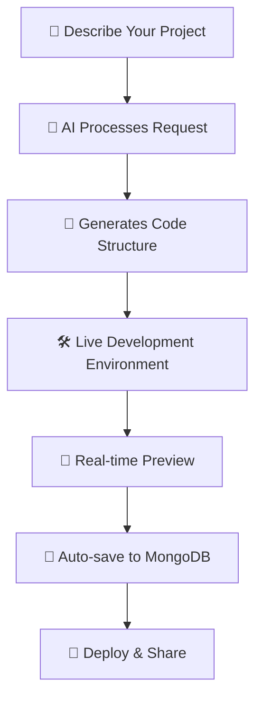

<div align="center">

# ✨ SiteSmith

### 🚀 Build Something Amazing with AI

*Transform your ideas into functional web applications through natural language conversations with AI*

[](https://github.com/Mukul2956/Sitesmith/stargazers)
[](https://opensource.org/licenses/MIT)
[](https://nodejs.org/)
[](https://www.typescriptlang.org/)

[🎬 View Demo](#-demo) • [🚀 Quick Start](#-quick-start) • [📚 Documentation](#-documentation) • [💬 Community](#-community)

</div>

---

## 🎯 What is SiteSmith?

SiteSmith is a revolutionary **AI-powered web development platform** that transforms natural language descriptions into fully functional web applications. No more struggling with boilerplate code or complex setup processes – just describe what you want to build, and watch the magic happen! ✨

<div align="center">
  
### 🎬 Demo

> **Coming Soon:** Interactive demo showcasing SiteSmith's capabilities

</div>

## 🌟 Key Features

<table>
<tr>
<td width="50%">

### 🤖 **Multiple AI Providers**
- **NVIDIA API** - Free tier available
- **Claude AI** - Premium experience
- **Extensible architecture** for future providers

### 💾 **Smart Project Management**
- Auto-save with MongoDB persistence
- Project history & version tracking
- Status filtering (active, completed, archived)

</td>
<td width="50%">

### 🛠️ **Full-Stack Development**
- Monaco Editor (VS Code engine)
- Live preview with WebContainer
- Built-in terminal & file explorer
- Real-time code generation

### 🎨 **Modern Tech Stack**
- React + TypeScript + Vite
- Tailwind CSS for styling
- Express.js backend
- MongoDB Atlas database

</td>
</tr>
</table>

## 🚀 Quick Start

### Prerequisites

Before you begin, ensure you have:
- 📦 **Node.js 18+** installed
- 🔑 **AI Provider API Key** (NVIDIA or Claude)
- 🍃 **MongoDB Atlas** connection (optional, for project persistence)

### Installation

```bash
# 1️⃣ Clone the repository
git clone https://github.com/Mukul2956/Sitesmith.git
cd Sitesmith

# 2️⃣ Install backend dependencies
cd backend && npm install

# 3️⃣ Install frontend dependencies  
cd ../frontend && npm install

# 4️⃣ Configure environment variables
cd ../backend && cp .env.example .env
# Edit .env file with your API keys and MongoDB URI

# 5️⃣ Start the development servers
# Terminal 1 - Backend
npm run dev

# Terminal 2 - Frontend (in another terminal)
cd frontend && npm run dev
```

### 🎉 Launch

Open your browser and navigate to **`http://localhost:5173`**

That's it! You're ready to build something amazing! 🚀

## 🤖 AI Provider Setup

<details>
<summary><b>🟢 NVIDIA API (Free Tier)</b></summary>

1. Visit [build.nvidia.com](https://build.nvidia.com/)
2. Sign up for a free account
3. Generate your API key
4. Add to `.env`: `NVIDIA_API_KEY=your_key_here`

**Best for:** Learning, experimentation, personal projects
</details>

<details>
<summary><b>🟣 Claude AI (Premium)</b></summary>

1. Visit [console.anthropic.com](https://console.anthropic.com/)
2. Create an account and add billing information
3. Generate your API key
4. Add to `.env`: `CLAUDE_API_KEY=your_key_here`

**Best for:** Production applications, complex projects
</details>

## 📚 Documentation

### 🏗️ How It Works



### 🎯 Use Cases

| Use Case | Description | Perfect For |
|----------|-------------|-------------|
| 🏃‍♂️ **Rapid Prototyping** | Build MVPs in minutes | Startups, Product Managers |
| 📚 **Learning** | Understand code patterns | Students, Beginners |
| ⚡ **Boilerplate Generation** | Skip repetitive setup | Experienced Developers |
| 🎓 **Education** | Interactive coding environment | Teachers, Bootcamps |
| 🤝 **Collaboration** | Share projects instantly | Teams, Code Reviews |

### 🔧 Technology Stack

<div align="center">

| Category | Technologies |
|----------|-------------|
| **Frontend** |     |
| **Backend** |    |
| **Database** |  |
| **AI Providers** |   |

</div>

## 🤝 Contributing

We love contributions! Here's how you can help make SiteSmith even better:

### 🐛 Found a Bug?
Open an [issue](https://github.com/Mukul2956/Sitesmith/issues) with detailed reproduction steps.

### 💡 Have an Idea?
We'd love to hear it! Open a [feature request](https://github.com/Mukul2956/Sitesmith/issues/new?template=feature_request.md).

### 🔧 Want to Code?
1. Fork the repository
2. Create a feature branch (`git checkout -b feature/amazing-feature`)
3. Commit your changes (`git commit -m 'Add amazing feature'`)
4. Push to the branch (`git push origin feature/amazing-feature`)
5. Open a Pull Request

## 🌟 Community

<div align="center">

### Join our growing community of developers!

[](https://github.com/Mukul2956/Sitesmith/discussions)
[](https://discord.gg/sitesmith)
[](https://twitter.com/sitesmith_dev)

</div>

## 📈 Roadmap

- [ ] 🔌 **More AI Providers** (OpenAI, Google Gemini)
- [ ] 🌐 **Deployment Integration** (Vercel, Netlify)
- [ ] 👥 **Real-time Collaboration**
- [ ] 📱 **Mobile App**
- [ ] 🎨 **Theme Customization**
- [ ] 🔧 **Plugin System**

## 📄 License

This project is licensed under the MIT License - see the [LICENSE](LICENSE) file for details.

## 🙏 Acknowledgments

- 💙 **WebContainer Team** for browser-based development environment
- 🤖 **AI Provider Teams** (NVIDIA, Anthropic) for powerful language models
- 🎨 **Open Source Community** for amazing tools and libraries
- 👥 **Contributors** who help make SiteSmith better every day

---

<div align="center">

### ⭐ Star us on GitHub if SiteSmith helps you build amazing things!

**Made with ❤️ by developers, for developers**

[⬆️ Back to top](#-sitesmith)

</div>
